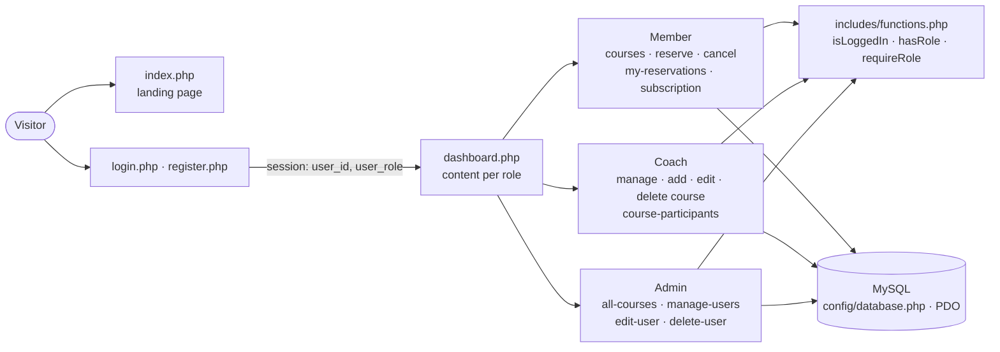
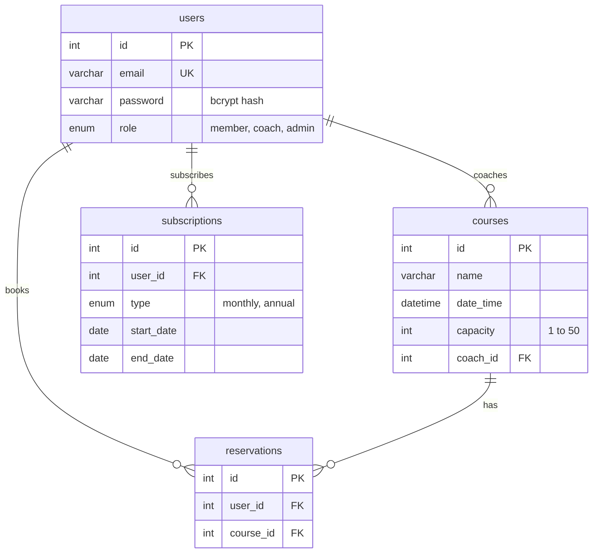

# FitManager — Fitness Class Booking Platform

> A PHP / MySQL web application for a fitness center, with **three roles**: **members** subscribe and book classes, **coaches** schedule and manage their classes, and **administrators** oversee users and the whole schedule. Every role gets its own dashboard.


---

## Table of contents

- [Features by role](#features-by-role)
- [Screenshots](#screenshots)
- [Architecture](#architecture)
- [Database](#database)
- [Business rules](#business-rules)
- [Security](#security)
- [Getting started](#getting-started)
- [Project structure](#project-structure)
- [Known limitations](#known-limitations)
- [Roadmap](#roadmap)
- [Author](#author)

---

## Features by role

### Member
- Sign up and log in
- Subscribe to a **monthly** (€29.99) or **annual** (€299.99) plan — payment is simulated
- Browse upcoming classes with coach, date and remaining places
- **Book** a class and **cancel** a booking for a class that hasn't started
- See upcoming and past bookings
- Dashboard: next 5 classes and current subscription

### Coach
- **Create, edit and delete** classes: name, date, time, capacity (1–50)
- See the list of participants for each class
- Dashboard: upcoming classes with their fill rate

### Administrator
- Dashboard: number of users per role and the next 10 classes
- See **every class**, upcoming and past, with its coach and participants
- **Manage users**: change email, role or password, delete an account (with all its related data)

### Everyone
- Landing page for visitors
- Profile page to update email and password (current password required to change it)
- Navigation menu adapted to the user's role

## Screenshots

<!-- TODO: add screenshots, e.g.


-->

## Architecture



The application follows a classic **page-per-action** PHP structure, with no framework. Each page:

1. starts the session and loads the database connection (`config/database.php`) and helpers (`includes/functions.php`);
2. checks that the user is logged in and has the required role, otherwise redirects to `login.php` or `access-denied.php`;
3. processes the form or action with **prepared statements**;
4. stores a one-time message in the session (`setAlert` / `displayAlert`) and redirects (**Post/Redirect/Get**), so refreshing the page doesn't resubmit the action.

## Database



The full schema is in [`database.sql`](./database.sql).

## Business rules

| Rule | Where it's enforced |
|---|---|
| A member needs an **active subscription** (`end_date ≥ today`) to book | `reserve-course.php` |
| A class can't be booked when **full**, **already booked** or **in the past** | `reserve-course.php` |
| A booking can only be cancelled **before** the class starts | `cancel-reservation.php` |
| A coach can only edit, delete or see participants of **their own** classes | `edit-course.php`, `delete-course.php`, `course-participants.php` |
| A class must be **in the future**, with a capacity between **1 and 50** | `add-course.php`, `edit-course.php` |
| Capacity can't be reduced **below the current number of bookings** | `edit-course.php` |
| Past classes can't be edited or deleted | `edit-course.php`, `delete-course.php` |
| An admin can't delete **their own** account | `delete-user.php` |
| Deleting a user or a class also deletes its bookings, inside a **database transaction** | `delete-user.php`, `delete-course.php` |

## Security

What the application does right:

- **No SQL injection:** every query uses PDO **prepared statements**, with emulated prepares disabled (`ATTR_EMULATE_PREPARES = false`).
- **Password hashing** with `password_hash()` / `password_verify()` (bcrypt), 6 characters minimum; the current password is required to set a new one.
- **Role-based access control** checked on every page, server side.
- **Ownership checks against IDOR:** queries filter on the logged-in user (`WHERE id = ? AND coach_id = ?`, `WHERE user_id = ?`), so changing an ID in the URL doesn't give access to another user's class or booking.
- **Output escaping:** user-controlled data (emails, class names) is escaped with `htmlspecialchars()` before display.
- **No self-promotion to admin:** sign-up only accepts the `member` and `coach` roles; the role is validated server side, not trusted from the form.
- **Atomic deletions:** cascading deletes run inside a transaction and are rolled back on error.

For the remaining gaps, see [Known limitations](#known-limitations).

## Getting started

### Prerequisites

- PHP 8.x with the `pdo_mysql` extension
- MySQL 5.7+ or MariaDB 10.3+
- A web server — Apache via **XAMPP/WAMP/MAMP**, or PHP's built-in server for development

### 1. Get the code

```bash
git clone https://github.com/AyoubElmortaji/FitManager.git
cd FitManager
```

With XAMPP, place the folder in `htdocs/`.

### 2. Create the database

```bash
# Create the "fitmanager" database and its four tables
mysql -u root -p < database.sql
```

Or open phpMyAdmin, go to the **Import** tab and import `database.sql`.

### 3. Configure the connection

Edit `config/database.php` if your credentials differ from the XAMPP defaults:

```php
$host = 'localhost';
$dbname = 'fitmanager';
$username = 'root';
$password = '';
```

### 4. Create the first administrator

Sign-up can't create an admin (on purpose), so the first one is created directly in the database. First generate a password hash:

```bash
# Print a bcrypt hash of the chosen password
php -r 'echo password_hash("ChooseAStrongPassword", PASSWORD_DEFAULT), PHP_EOL;'
```

Then insert the account, replacing `<hash>` with the output:

```sql
INSERT INTO fitmanager.users (email, password, role)
VALUES ('admin@fitmanager.local', '<hash>', 'admin');
```

### 5. Run

With XAMPP, start Apache and MySQL, then open `http://localhost/FitManager/`.

Or, for development, with PHP's built-in server:

```bash
# Serve the current folder at http://localhost:8000 (development only)
php -S localhost:8000
```

Sign up as a **coach**, create a class; then sign up as a **member**, subscribe and book it.

## Project structure

```
FitManager/
├── index.php / index.html     # landing page (redirects to the dashboard if logged in)
├── login.php · register.php · logout.php
├── dashboard.php              # dashboard, content depends on the role
├── profile.php                # update email / password
├── access-denied.php
│
├── courses.php                # member: upcoming classes
├── reserve-course.php         # member: book
├── cancel-reservation.php     # member: cancel
├── my-reservations.php        # member: upcoming and past bookings
├── subscription.php           # member: plans and subscription
│
├── manage-courses.php         # coach: my classes
├── add-course.php · edit-course.php · delete-course.php
├── course-participants.php    # coach (own classes) and admin
│
├── all-courses.php            # admin: every class
├── manage-users.php · edit-user.php · delete-user.php
│
├── config/database.php        # PDO connection
├── includes/
│   ├── functions.php          # session, role and alert helpers
│   └── header.php             # navigation menu per role
├── assets/css/                # style.css, landing.css
├── database.sql               # database schema
└── logo.png
```

## Known limitations

**Security**

- **No CSRF protection.** State-changing actions (book, cancel, delete a class, delete a user) are plain `GET` links, and forms carry no anti-CSRF token. A malicious page visited by a logged-in administrator can make their browser call `delete-user.php?id=…` and delete an account. Fix: POST-only actions with a per-session token.
- **Session fixation.** The session ID is not regenerated at login (`session_regenerate_id(true)` is missing), and session cookies have no explicit `HttpOnly`, `Secure` or `SameSite` settings.
- **Anyone can register as a coach.** The coach role is chosen by the visitor at sign-up; it should be granted by an administrator.
- **Database errors shown to users.** Error messages include `PDOException` details, which reveal the database structure.
- **No brute-force protection** on the login form.
- **Default database credentials** (`root` with an empty password) are hard-coded in `config/database.php`.

**Functional**

- Payment is simulated: subscribing records the plan without any payment step.
- Two members booking the last place at the same moment can both succeed (no locking on capacity).
- No attendance tracking, no coach-side cancellation notice to members, no email notifications.

## Roadmap

- [ ] CSRF tokens and POST-only state-changing actions
- [ ] `session_regenerate_id(true)` at login, hardened cookie settings
- [ ] Coach accounts approved by an administrator
- [ ] Generic error messages to users, details in server logs
- [ ] Login rate limiting
- [ ] Configuration through environment variables (`.env`)
- [ ] Transaction with row locking when booking, to enforce capacity under concurrency
- [ ] Payment integration (e.g. Stripe test mode)
- [ ] Email notifications (booking confirmation, class cancelled)
- [ ] Attendance tracking and statistics for coaches

## Author

**Ayoub ELMORTAJI** — Engineering student in Cybersecurity & Cloud Computing, ENSAM Casablanca · [GitHub](https://github.com/AyoubElmortaji)
